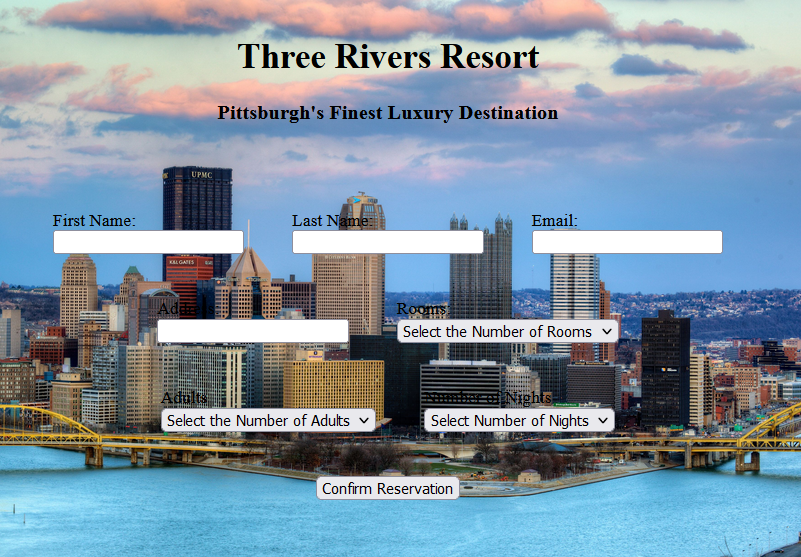

# Hotel Booking Form Project
### SDMM Project 2

### Summary

This is project 2 in Software Development Mastermind, Andy Sterkowitz mentorship program for self-taught developers. This program taught me quite a bit about styling, one of my biggest struggles as a programmer. I ended up doing many unnecessary styling maneuvers, making this project far more complicated than it needed to be. The form contains validation and styling using CSS flex as well as a submit button.

### Author

#### Elijah C Walker - Systems Engineer, US Navy Veteran